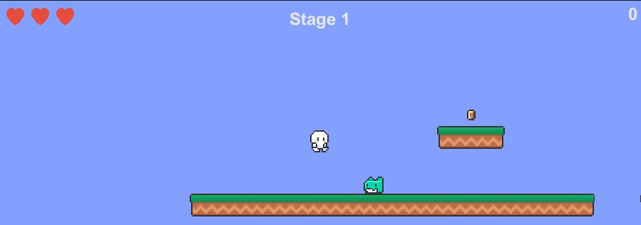

# 🎲 Marshmellow Running

## 📖 프로젝트 소개  

유튜버 "골드메탈" 님의 강의를 참고해 만든 2D 플랫포머 게임입니다.  

- 게임 이름: Marshmellow Running   
- 장르: 2D, 캐주얼 플랫포머  
- 목표: 캐릭터를 조작해 지형을 뛰어넘어 몬스터를 피하거나 밟아 죽이고 동전을 모으면서 스테이지를 탈출.  
- 구성: 캐릭터(Player), 몬스터(Enemy), 지형(Platform), 출구(Finishing point), 동전(브론즈, 실버, 골드)  
- 개발 기간: 2025-10-20 ~ 2025-10-27

---

## 🕹️ 게임 방법  

- 키보드 W, A, S, D(이동키)와 Space bar(점프키)를 사용해서 캐릭터를 이동시킵니다.  
- 캐릭터가 낙사하거나 몬스터 혹은 스파이크와 충돌했을 때 체력이 한 칸씩 깎입니다.  
- 체력이 다 닳으면 캐릭터가 죽으면서 재시작 버튼이 중앙에 나타납니다.  
- 스테이지 도중에 죽으면 다시 1 스테이지부터 시작합니다.  
- 깃발에 도달하면 다음 스테이지로 이동합니다.  

---

## 🟨 게임 실행

<링크 접속하면 게임 플레이 가능>

-> https://github.com/ByunSSang-min/Marshmello_Running_github.io

---

## 🟦 개발 중 새로 배운 점 혹은 발생한 문제점과 해결과정

● 다음 스테이지로 로드할 때 로드 조건을 이전에 했던 것처럼 scene을 로드하는 것이 아닌 하나의  
scene 내에서 스테이지 오브젝트를 로드하는 방식으로 바꿨는데 그로 인해 스크립트 코딩이 많이 간편  
해졌음.  

● 캐릭터가 계속 조작 중에 미끄러져서 조작감 문제 발생.

-> 캐릭터 Inspector에서 constraints 부분의 Freeze Rotation을 체크함으로써 일시적으로 해결함.  
허나, 여전히 경사면이나 몬스터를 밟고 내려올 때 미끄러짐은 해결 X.

---

## 🛠️ 개발 환경

- Unity 6.2 version  
- Visual Studio 2022 (C#)